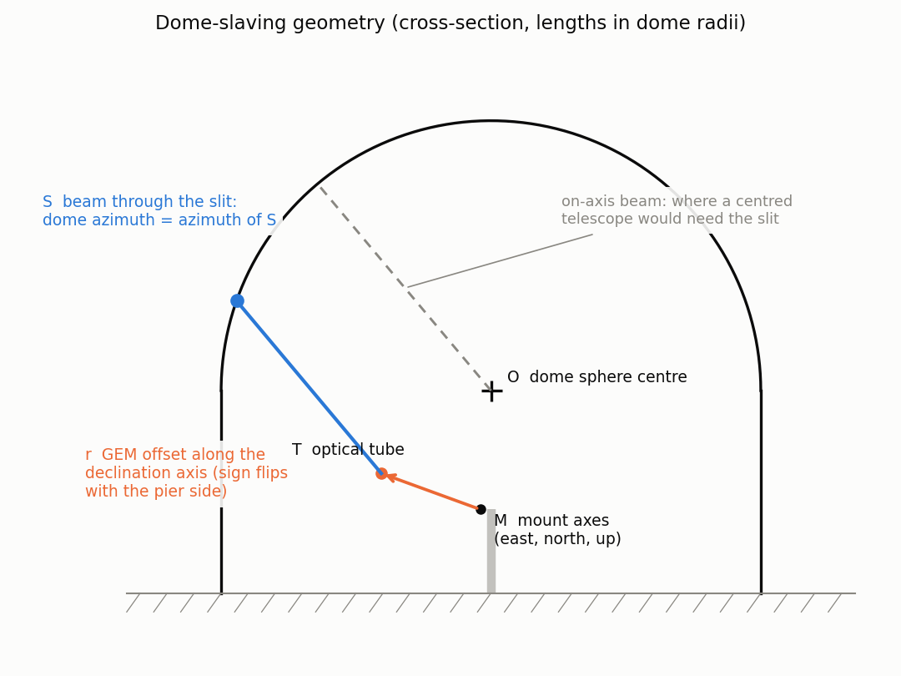
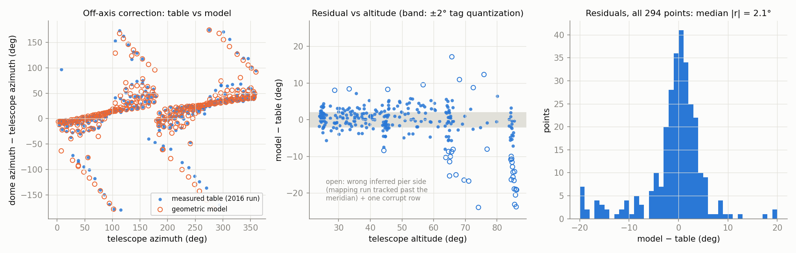

# Dome geometry model

`DomeLNA` has to park the dome slit in front of the telescope beam. Because the
telescope sits on a German equatorial mount (GEM) that is offset from the dome
center, the dome azimuth is *not* the telescope azimuth: the correction is
±180° near the zenith and ~25° (median) everywhere else.

Until 2026 the driver answered this with a nearest-neighbor lookup table
([`data/model.csv`](../src/chimera_lna/data/model.csv)): 294 (alt, az) → tag
pairs measured by hand in May 2016. The table works where it is dense, but
nearest-neighbor has no notion of pier side — near the zenith adjacent sky
positions were measured on opposite sides of the pier and map to dome azimuths
180° apart, so the nearest entry can be the wrong one — and it extrapolates
badly toward the horizon where the run took few points.

The lookup is now replaced by the closed-form geometric model in
[`util/dome_geometry.py`](../src/chimera_lna/util/dome_geometry.py), whose five
parameters were fitted to that same 2016 run. The model reproduces the table to
its own quantization everywhere, is continuous through the zenith, and is
defined at any (alt, az).

## The model

Work in a frame centered on the dome sphere, x = East, y = North, z = up, with
every length in units of the dome radius (so the dome is the unit sphere). For
a telescope pointing at altitude *a* and azimuth *A* (from North, through
East), the beam direction is

    p = (sin A cos a,  cos A cos a,  sin a)

The polar axis unit vector **â** points at the visible celestial pole (for
LNA, azimuth 180°, altitude |φ| with φ = −22.5344°). On a GEM the optical tube
rides on the declination axis, displaced from the intersection of the mount
axes **M** by the *GEM offset* r along the declination-axis direction

    d = â × p / |â × p|

with a sign s that flips when the mount flips sides of the pier
(s = +1 west of the meridian, hour angle > 0). The tube center is therefore

    T = M + s·r·d

and the dome azimuth is the azimuth of the point S where the ray T + t·p
(t > 0) pierces the unit sphere, plus a constant Δ that absorbs the tag-ring
zero-point error:

    t  = −T·p + sqrt((T·p)² + 1 − T·T)
    S  = T + t·p
    az = atan2(Sx, Sy) + Δ

Two degenerate cases are handled explicitly: pointing along the polar axis
leaves d undefined (|â × p| → 0), and the GEM offset is then ignored; a
parameter set that puts T outside the unit sphere raises instead of returning
garbage.

### Pier side

`dome_az(alt, az, side=None)` infers the pier side from the pointing itself:
sin(HA) = −sin(A)·cos(a)/cos(δ), so the sign of the hour angle is just the
sign of −sin(A). This is exact except in the short window after transit and
before the automatic pier flip (`pier_flip_ha` in chimera core), where the
mount is still on its pre-transit side. Callers that know the true side (e.g.
from a future `Telescope.get_pier_side()`) can pass `side=±1` explicitly.

## Fitted parameters

Fitted to the 2016 mapping run with
[`scripts/fit_dome_geometry.py`](../scripts/fit_dome_geometry.py) (robust
least squares; the pier side of each point starts as sign(HA) and is
reassigned to whichever side the model predicts better, since the run tracked
past the meridian on ~5% of the points; > 5σ outliers dropped):

| parameter | config key | value (dome radii) | 1σ |
|---|---|---|---|
| mount offset East | `mount_offset_east` | −0.0384 | 0.005 |
| mount offset North | `mount_offset_north` | −0.0142 | 0.004 |
| mount offset Up | `mount_offset_up` | −0.436 | 0.08 |
| GEM offset | `gem_offset` | −0.390 | 0.02 |
| tag-ring zero point Δ | `dome_az_offset` | +19.7° | 0.3° |

Read physically: the pier is nearly centered in the dome (a few cm off), the
mount axes cross ~0.44 dome radii *below* the center of the dome sphere (the
sphere center sits at the top of the cylindrical wall), and the optical axis
is 0.39 dome radii from the RA axis. The +19.7° zero point means tag 801 is
**not** at azimuth 270° as `_tag_to_az` assumes — the tag ring is offset by
about ten tags; the model output already includes the correction, so `get_az`
values remain in the same (offset) frame the dome has always reported.

All five values live in the `DomeLNA.__config__`, so a refit is a
configuration change, not a code change.

## Fit quality

Left: the off-axis correction (dome − telescope azimuth) across the sky; the
model (open orange) tracks the measured table (blue) through the full ±180°
swing near the zenith. Middle: residuals stay inside the ±2° tag quantization
band at every altitude; the open circles are points whose inferred pier side
is wrong because the mapping run tracked past the meridian, plus one corrupt
table row (alt 44.2°, az 115.1°, tag 814 — 158° off, dropped from the fit).
Right: the residual distribution over all 294 points.

Numbers, against the 293 clean points:

- azimuth residual: median 2.0°, rms 5.6° — at the 2°/tag quantization floor;
- miss transverse to the slit (azimuth error × cos of the beam's elevation at
  the dome — the quantity that decides whether the beam clears the slit):
  median 1.4°, maximum 7.3°, flat from the horizon to the zenith.

The apparent large *azimuth* residuals above 85° altitude are harmless: near
the zenith a degree of transverse miss corresponds to tens of degrees of
azimuth, and both the model error and the table's own sloppiness there stay
within the slit opening.

## Caveats, and refitting

- The mapping run is dated **2016-05-06** and may predate the current
  PlaneWave CDK17 / Paramount ME: a GEM offset of 0.39 dome radii (~1 m for a
  ~2.5 m dome radius) is large for that mount. The model faithfully encodes
  whatever geometry the table measured — swapping it in changes no commanded
  position by more than the table's own noise — but a fresh mapping run with
  the current telescope would nail the true geometry and is the actual fix
  for any residual zenith/horizon misbehavior.
- To refit: log ~30+ points of (ALT, AZ, HA in radians, tag) covering both
  pier sides and the altitude extremes into a CSV with the `model.csv` header,
  run `uv run scripts/fit_dome_geometry.py <csv>`, and paste the printed block
  into the dome section of the observatory config (or the driver defaults).
- [`util/lookup_table.py`](../src/chimera_lna/util/lookup_table.py) and
  `data/dome_model.csv` are kept only as the reference the tests compare the
  model against.
